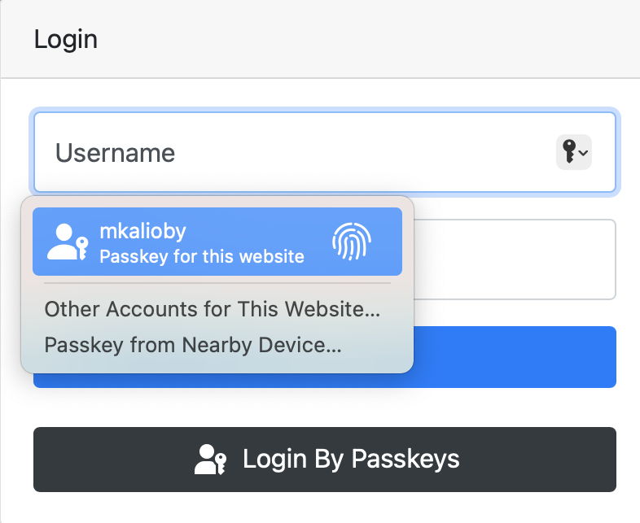

# django-passkeys

[](https://badge.fury.io/py/django-passkeys)
[](https://pepy.tech/project/django-passkeys)
[](https://pepy.tech/project/django-passkeys)
[](https://github.com/mkalioby/django-passkeys/actions/workflows/basic_checks.yml)


An extension to Django's *ModelBackend* that supports passkeys.

Passkeys are an extension to Web Authentication API that allow the user to log in to a service using a securely stored
key on the same or another device.

This app is a slimmed-down version of [django-mfa2](https://github.com/mkalioby/django-mfa2).

Passkeys are supported on **all major browsers and operating systems**.
See [passkeys.io](https://www.passkeys.io/compatible-devices) for details.
On May 3, 2023, Google enabled Passkeys for the users to login, killing the password for enrolled users.

## Installation

`pip install django-passkeys`

Currently, django-passkeys supports Django 2.0+ and Python 3.7+.

## Usage

**Important note**: Passkeys only work in a secure context, i.e., when using SSL/HTTPS.

### Setup

1. In your `settings.py`, add the application to your installed apps.
   ```python
    INSTALLED_APPS=(
        '......',
        'passkeys',
        '......',
    )
   ```
   **Note**: Only apps listed before `passkeys` are able to override templates and static files of this app.
2. Run `collectstatic`:
   `python manage.py collectstatic`
3. Run `migrate`:
   `python manage.py migrate`
4. Make the following changes to your settings.py file:
    ```python
    # Update authentication backends, replacing 'django.contrib.auth.ModelBackend' with 'passkeys.backend.PasskeyModelBackend'
    AUTHENTICATION_BACKENDS = ['passkeys.backend.PasskeyModelBackend'] 
    # Server RP ID for FIDO2 - Use the full domain name (but without subdomains like "www.") of your project
    FIDO_SERVER_ID="localhost"
    # Server Name - You can choose any name here, preferably the one of your application.
    FIDO_SERVER_NAME="TestApp"
   
    # Optionally, restrict the use to cross platform (roaming) or platform authenticators.
    # See https://www.w3.org/TR/webauthn/#sctn-authenticator-attachment-modality for details
    import passkeys
    KEY_ATTACHMENT = None  # No restriction (default if left out)
    KEY_ATTACHMENT = passkeys.Attachment.CROSS_PLATFORM  # Only cross-platform / roaming authenticators allowed
    KEY_ATTACHMENT = passkeys.Attachment.PLATFORM  # Only platform authenticators allowed
    ```
   **Note**: Starting with v1.1, `FIDO_SERVER_ID` and/or `FIDO_SERVER_NAME` can be a callable to support multi-tenants
   web applications, the `request` is passed to the called function.
5. Add passkeys to urls.py:
    ```python
    urlpatterns= [
        '...',
        path('passkeys/', include('passkeys.urls')),
        '....',
    ]
    ```
6. In your login view, change the authenticate call to include the request as follows:
    ```python
    user = authenticate(request, username=request.POST["username"], password=request.POST["password"])
    ```
   **Note**: If you use `django.contrib.auth`'s LoginView, you must override the `form_class` used.
7. Integrate passkey login in your login template (e.g. `login.html`):
    * Give an id to your login form, e.g 'loginForm', which will be used below.
    * Inside the form, add
      ```html
       <input type="hidden" name="passkeys" id="passkeys" />
       <button class="btn btn-block btn-dark" type="button" onclick="authn('loginForm')">
            
       </button>
       
      ```
8. To match the look and feel of your project, Passkeys includes `base.html`, but it needs blocks named `head` &
   `content` to add its content to them.
   **Notes:**
    1. `Passkeys_base.html` extends `base.html`.
    2. You can override `PassKeys_base.html`, which is used by `Passkeys.html` so you can control the styling better.
    3. Currently, `PassKeys_base.html` depends on JQuery and Bootstrap.
9. Somewhere in your app, add a link to 'passkeys:home'
   ```html
    <a href="">Manage Passkeys</a>
   ```

For more information about how to set it up, please see the 'example' app and the EXAMPLE.md document.

### Detect if user is using passkeys

Once the backend is used, there will be a `passkey` key in `request.session`.
If the user used a passkey, then `request.session['passkey']['passkey']` will be `True` and the key information will be
available in the following format:

```python
# request.session['passkey'] if the user signed in with a passkey
{'passkey': True, 'name': 'Chrome', 'id': 2, 'platform': 'Chrome on Apple', 'cross_platform': False}
```

* `cross_platform`: means that the user used a key from another platform, so there is no key locally to the device used to
login. This might be the case e.g if a user used an Android phone to log in on Windows.

If the user didn't use a passkey, then `request.session['passkey']['passkey']` will be set to `False`:

```python
# request.session['passkey'] if the used didn't sign in with a passkey
{'passkey': False}
```

### Check if the user can be enrolled for a platform authenticator

If you want to check if the user can be enrolled to use a platform authenticator, you can do the following in your main
page:

```html

<div id="pk" class="alert alert-info" style="display: none">
    Your device supports passkeys! <a href="">Enroll now</a>
</div>
<script type="text/javascript">
    

    function showPasskeyEnrollmentInfo() {
        $('#pk').show();
    }

    $(document).ready(check_passkey(true, showPasskeyEnrollmentInfo))
</script>
```

The `check_passkey` function parameters are as follows:

* `platform_authenticator`: if the service requires only a platform authenticator (e.g TouchID, Windows Hello or Android
  SafetyNet)
* `success_func`: function to call if a platform authenticator is found and if the user didn't login with a passkey
* `fail_func`: function to call if no platform authenticator is found (optional).

### Use Conditional UI

Conditional UI is a way for the browser to automatically prompt the user to use the passkey to log in, if he has one.
The following screenshot shows how this might look in macOS:



Starting with v1.2, you can use Conditional UI by adding the following to your login page:

1. Add `webauthn` to the autocomplete attribute of the username field as shown below.
   ```html
   <input name="username" placeholder="username" autocomplete="username webauthn">
   ```
2. Add the following to the page JavaScript, where `loginForm` is the id of your login form.
   ```js
   window.addEventListener("load", () => checkConditionalUI('loginForm'));
   ```

## Security contact information

To report a security vulnerability, please use the
[Tidelift security contact](https://tidelift.com/security).
Tidelift will coordinate the fix and disclosure.

## Contributors

* [mahmoodnasr](https://github.com/mahmoodnasr)
* [jacopsd](https://github.com/jacopsd)
* [gasparbrogueira](https://github.com/gasparbrogueira)
* [pulse-mind](https://github.com/pulse-mind)
* [rafaelurben](https://github.com/rafaelurben/)
