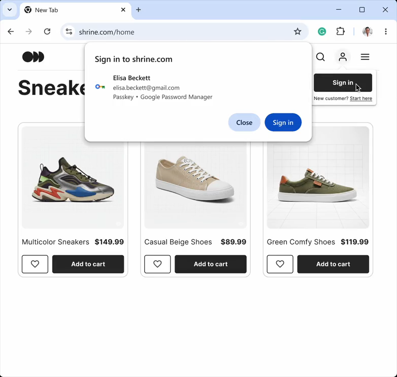

# django-passkeys

[](https://badge.fury.io/py/django-passkeys)
[](https://pepy.tech/project/django-passkeys)
[](https://pepy.tech/project/django-passkeys)
[](https://github.com/mkalioby/django-passkeys/actions/workflows/basic_checks.yml)


An extension to Django *ModelBackend* backend to support passkeys.

Passkeys is an extension to Web Authentication API that will allow the user to login to a service using another device.

This app is a slimmed-down version of [django-mfa2](https://github.com/mkalioby/django-mfa2)

Passkeys are now supported on
* Apple Ecosystem (iPhone 16.0+, iPadOS 16.1, Mac OS X Ventura)
* Chromium based browsers (on PC and Laptop) allows picking up credentials from Android and iPhone/iPadOS.
* Android Credentials creation for ResidentKeys is currently live.

On May 3, 2023, Google allowed the use of Passkeys for the users to login, killing the password for enrolled users.

**[Full Documentation](https://mkalioby.github.io/django-passkeys)**

## Installation

```
pip install django-passkeys
```

For DRF (REST API) support:
```
pip install django-passkeys[drf]

# With JWT:
pip install django-passkeys[drf-jwt]
```

## Choose Your Integration

django-passkeys supports two integration modes. Pick the one that fits your project:

| | Template-Based | REST API (DRF) |
|---|---|---|
| **Best for** | Server-rendered Django apps | SPAs, mobile apps, headless APIs |
| **Auth flow** | Session-based with Django forms | Token-based (JWT, DRF Token, or Session) |
| **Frontend** | Django templates with jQuery | Any frontend (React, Vue, mobile, etc.) |
| **Setup guide** | [Template Setup](docs/template-setup.md) | [DRF Setup](docs/drf-setup.md) |

Both can coexist in the same project — you can use templates for your web app and the API for your mobile app.

### Quick Start — Common Settings

Regardless of which integration you choose, add these to your `settings.py`:

```python
INSTALLED_APPS = [
    ...
    'passkeys',
]

AUTHENTICATION_BACKENDS = ['passkeys.backend.PasskeyModelBackend']
FIDO_SERVER_ID = "localhost"      # Must match your domain
FIDO_SERVER_NAME = "TestApp"
```

Then follow the guide for your chosen integration:
- **[Template-Based Setup](docs/template-setup.md)** — Django templates with session auth
- **[REST API Setup (DRF)](docs/drf-setup.md)** — REST endpoints with pluggable token backend

## Example Project

See the `example` app and [Example.md](Example.md) for a working demo.

## Using Immediate Mediation 

Immediate Mediation is an extension to WebAuthn API that allows the browser to immediately prompt the user to use password/passkeys
without the need of a login form. This is currently supported by Google Chrome 144+ and soon on Android devices. 

You can watch demo showed by Google

[](https://developer.chrome.com//static/blog/webauthn-immediate-mediation-ot/video/immediate-mediation-explicit-flow.mp4)

To enable this feature in your pages add a new hidden form in your page that the passkeys can use to send to the server.

```html

<form id="loginForm" action="" method="post" style="display: none">
      
    <input type="hidden" id="passkeys" name="passkeys" />
    <input type="hidden" id="username" name="username" />
    <input type="hidden" id="password" name="password" />
  </form>
```

You can check [public.html](exmple/testapp/templates/public.html) for an example of how to configure it.

**Note**: setting `allow_password` to `True` (default `False`) will allow the user to login by password if 
that what is stored in the password manager, otherwise, the user will be forced to login by passkeys.

## Security contact information

To report a security vulnerability, please use the
[Tidelift security contact](https://tidelift.com/security).
Tidelift will coordinate the fix and disclosure.

## Contributors
* [mahmoodnasr](https://github.com/mahmoodnasr)
* [jacopsd](https://github.com/jacopsd)
* [gasparbrogueira](https://github.com/gasparbrogueira)
* [pulse-mind](https://github.com/pulse-mind)
* [ashokdelphia](https://github.com/ashokdelphia)
* [offbyone](https://github.com/offbyone)
* [resba](https://github.com/resba)
* [ganiyevuz](https://github.com/ganiyevuz)
* [smark-1](https://github.com/smark-1)
* [ThomasWaldmann-1](https://github.com/ThomasWaldmann)
* [rafaelurben](https://github.com/rafaelurben)